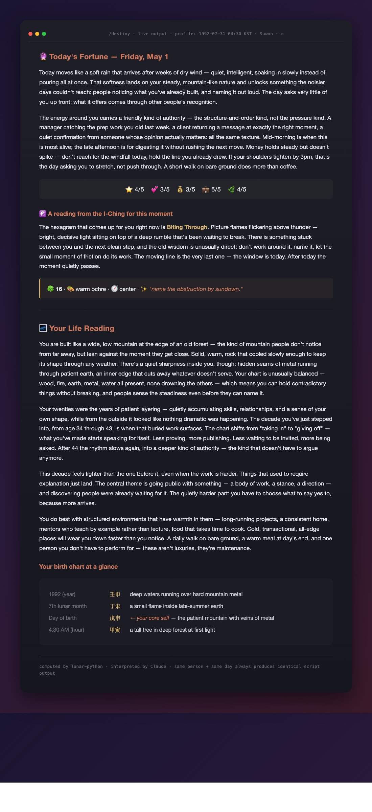

<p align="center">
  
</p>

<h1 align="center">destiny</h1>

<p align="center">
  A real fortune-telling skill for <a href="https://claude.com/claude-code">Claude Code</a>.<br>
  Not a horoscope generator. The numbers are computed; only the interpretation is generative.
</p>

---

## Quick start

```
/plugin marketplace add xodn348/destiny
/plugin install destiny@destiny-marketplace
/destiny
```

That's it. The first call asks for your birth date, time, city, and gender — once. Every call after is just `/destiny`.

## How it flows

```
Claude Code
   │
   ▼
destiny plugin            ← installed once via /plugin install
   │
   ▼
/destiny skill            ← invoked any time
   │
   ▼
your birth date           ← asked once, saved to ~/.destiny/profile.json
   │
   ▼
destiny of the day        ← personalized: today's fortune + life reading
```

## What you get

Each `/destiny` produces a two-section reading:

**🔮 Today's Fortune** — a short prose reading of today against your birth chart, with five-category stars (overall, love, money, career, health), a hexagram drawn for this moment, and a lucky number / color / direction.

**🌌 Life Reading** — your character, the broad arc of your life, and where you are in your current 10-year period. Plain language, no untranslated jargon.

## Example output

<p align="center">
  
</p>

<p align="center"><sub>Real run from a sample profile (1992-07-31, Suwon). Same person + same day always produces identical script output; only the prose phrasing changes between calls.</sub></p>

## How it works (the principles in 60 seconds)

This skill uses three pieces of classical East Asian metaphysics, each computed deterministically from your birth date and time:

- **Four Pillars (the eight-character birth chart)** — Your year, month, day, and hour of birth each map to a pair of Chinese characters (one "Heavenly Stem" + one "Earthly Branch") drawn from a 60-cycle calendar that has run continuously for over two millennia. The eight characters together describe your "elemental fingerprint": which of the five elements (Wood / Fire / Earth / Metal / Water) dominate, which are missing, and how they relate. The character of your day-of-birth is your "core self".

- **Perpetual lunar calendar** — The engine that converts solar dates to the eight characters. It handles solar terms (the 24 climate divisions of the year), lunar/solar conversion, true-solar-time correction by birthplace longitude, and Korean Daylight Saving for births in 1987–88. Equivalent to the calendar published by Korea's national astronomical observatory.

- **The I-Ching (Book of Changes)** — A 3,000-year-old divination system of 64 hexagrams. We draw one hexagram for the present moment using *plum-blossom time divination* — an algorithm by the Song-dynasty scholar Shao Yong that derives the hexagram from the current lunar date and hour. Hexagram texts are from James Legge's 1899 public-domain translation.

The skill computes today's "day pillar" the same way and analyzes its relationship with your birth chart — five-element generation/control cycles, branch harmonies and clashes — to produce the reading.

## What's actually computed (vs. interpreted by Claude)

| Layer | Source |
|---|---|
| Your eight-character birth chart | [`lunar-python`](https://github.com/6tail/lunar-python) — pure-Python perpetual calendar |
| True solar time correction | longitude offset from local standard time meridian (1° = 4 min) |
| Korean DST handling (1987–88) | automatic |
| Today's day pillar | `lunar-python` |
| Five Elements + Ten Gods relationships | classical 60-cycle lookup tables |
| Branch harmonies, clashes, punishments | classical lookup tables |
| I-Ching hexagram for this moment | plum-blossom time divination |
| Hexagram corpus | King Wen ordering, Legge (1899) public-domain translation |
| Lucky number / color / direction | derived from your day-of-birth's element + the hexagram |
| **Star ratings, character sketch, life arc, today's advice** | **Claude, applying classical reading conventions to the data above** |

Same person + same day always produces identical script output. Only the prose phrasing changes between calls.

No external APIs. No scraped sites. Everything runs locally.

## Variants

- `/destiny` — full reading (auto-loads saved profile)
- `/destiny today` — only today's fortune
- `/destiny life` — only life reading
- `/destiny reset` — delete saved profile and start over
- `/destiny in english|korean|japanese|chinese|spanish` — switch language
- `/destiny born YYYY-MM-DD HH:MM <city> <m|f>` — one-off without saving
- `/destiny quick` — generic daily, no personal data

## Why this exists

Most fortune apps either (a) compute the chart correctly but lock interpretation behind a paywall, or (b) let an LLM hallucinate the whole thing and call it astrology. This skill keeps the deterministic part deterministic — you can verify your eight characters against any traditional calendar source — and lets Claude do what it's actually good at: applying centuries-old reading conventions to that fixed data.

Default output is English with every classical term unpacked into plain language. A reader with zero exposure to East Asian astrology should follow it. Output switches to Korean / Japanese / Chinese / Spanish on request.

## Stack

- Python 3.10+
- [`lunar-python`](https://github.com/6tail/lunar-python) (MIT) — pure-Python perpetual lunar calendar
- I-Ching: King Wen ordering + Legge (1899) public-domain judgments
- Claude Code plugin format

## License

MIT
